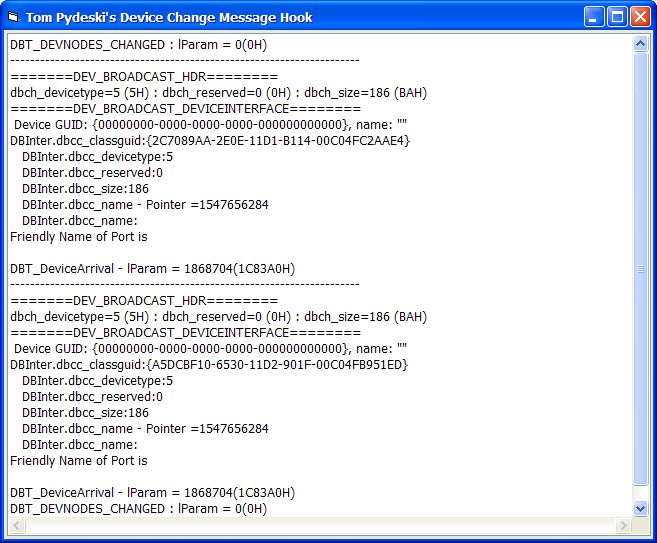

<div align="center">

## Windows Device Message Hook


</div>

### Description

'module for subclassing the DeviceChange Windows Message

'Windows sends all top-level windows a set of default WM_DEVICECHANGE messages when

'new devices or media (such as a CD or DVD) are added and become available, and when

'existing devices or media are removed.

This program should detect the following:

-CD or DVD inserted into drive

-Floppy inserted

-USB thumbdrive or external hard drive added

-USB serial port added

-probably a lot of other hardware changes, but

I could not test a lot of others

Modified to add Device Notification information about new hardware.
 
### More Info
 
Run the code and change hardware.

Displays data for the proper structure for new devices

It subclasses, so DON'T Quit the IDE without closing the program first or VB will CRASH!


<span>             |<span>
---                |---
**Submitted On**   |2007-04-16 12:15:02
**By**             |[Tom Pydeski](https://github.com/Planet-Source-Code/PSCIndex/blob/master/ByAuthor/tom-pydeski.md)
**Level**          |Intermediate
**User Rating**    |5.0 (45 globes from 9 users)
**Compatibility**  |VB 6\.0
**Category**       |[Windows System Services](https://github.com/Planet-Source-Code/PSCIndex/blob/master/ByCategory/windows-system-services__1-35.md)
**World**          |[Visual Basic](https://github.com/Planet-Source-Code/PSCIndex/blob/master/ByWorld/visual-basic.md)
**Archive File**   |[Windows\_De2060784162007\.zip](https://github.com/Planet-Source-Code/tom-pydeski-windows-device-message-hook__1-61104/archive/master.zip)

### API Declarations

```
Declare Sub CopyMemory Lib "kernel32" Alias "RtlMoveMemory" (pDst As Any, pSrc As Any, ByVal ByteLen As Long)
Declare Function SetWindowLong Lib "user32" Alias "SetWindowLongA" (ByVal hWnd As Long, ByVal nIndex As Long, ByVal dwNewLong As Long) As Long
Declare Function CallWindowProc Lib "user32" Alias "CallWindowProcA" (ByVal lpPrevWndFunc As Long, ByVal hWnd As Long, ByVal Msg As Long, ByVal wParam As Long, ByVal lParam As Long) As Long
```


